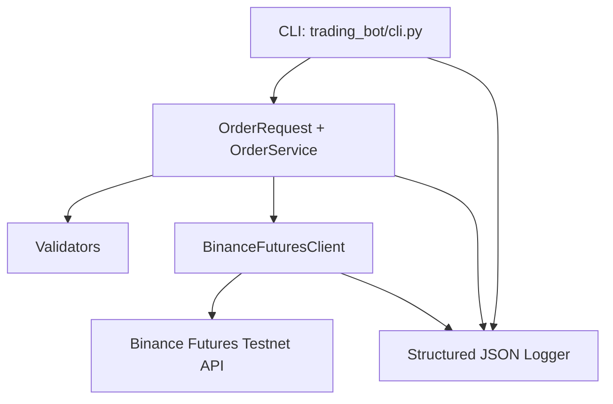

# Binance Futures Testnet Trading Bot (Python)

> A clean, interview-ready trading bot CLI for Binance **USDT-M Futures Testnet**.

This project is designed so a reviewer can clone, configure, and run it in one pass.

---

## Table of Contents

1. [What this project does](#what-this-project-does)
2. [Architecture overview](#architecture-overview)
3. [Prerequisites](#prerequisites)
4. [Quick start (5 minutes)](#quick-start-5-minutes)
5. [How to get Binance Testnet API keys](#how-to-get-binance-testnet-api-keys)
6. [Configuration](#configuration)
7. [CLI command reference](#cli-command-reference)
8. [Run examples](#run-examples)
9. [Expected output](#expected-output)
10. [Logs and observability](#logs-and-observability)
11. [How validation works](#how-validation-works)
12. [Testing](#testing)
13. [Troubleshooting](#troubleshooting)
14. [Project structure](#project-structure)
15. [Assumptions and design decisions](#assumptions-and-design-decisions)
16. [Security notes](#security-notes)

---

## What this project does

### Core requirements covered

- Places **MARKET** and **LIMIT** orders on Binance Futures Testnet (`https://testnet.binancefuture.com`)
- Supports both sides: `BUY` and `SELL`
- Accepts and validates CLI input:
  - `symbol` (e.g., `BTCUSDT`)
  - `side` (`BUY` / `SELL`)
  - `type` (`MARKET` / `LIMIT`)
  - `quantity`
  - `price` (required for LIMIT)
- Prints clear execution summary and response details
- Logs request/response/errors to file
- Includes exception handling for invalid input, API errors, and network errors

### Bonus implemented

- Additional order type: `STOP_MARKET`
- Exchange-rule pre-validation against `LOT_SIZE` and `PRICE_FILTER`

---

## Architecture overview



### Module responsibilities

- `trading_bot/cli.py`
  - Parses CLI args
  - Validates and prints request/response summary
  - Handles top-level exceptions and exit codes
- `trading_bot/bot/orders.py`
  - Domain model (`OrderRequest`)
  - Converts user input into Binance API params
  - Orchestrates exchange-rule validation and order placement
- `trading_bot/bot/validators.py`
  - Field-level validation (symbol/side/type/quantity/price/stop-price)
  - Exchange filter checks (`LOT_SIZE`, `PRICE_FILTER`)
- `trading_bot/bot/client.py`
  - Request signing (HMAC SHA256)
  - HTTP communication, retry/backoff
  - API/network error normalization
- `trading_bot/bot/logging_config.py`
  - Structured JSON logging setup

---

## Prerequisites

- Python **3.10+**
- A Binance Futures Testnet account
- Binance Testnet API key + secret

> This project intentionally uses only Python standard library for runtime HTTP interactions.

---

## Quick start (5 minutes)

### 1) Clone repo

```bash
git clone <your-repo-url>
cd Binance-Futures-Testnet-Trading-Bot-Python-
```

### 2) Create virtual environment

```bash
python -m venv .venv
source .venv/bin/activate
```

On Windows PowerShell:

```powershell
python -m venv .venv
.venv\Scripts\Activate.ps1
```

### 3) Install dependencies

```bash
pip install -r requirements.txt
```

### 4) Set API credentials

```bash
export BINANCE_TESTNET_API_KEY="your_key"
export BINANCE_TESTNET_API_SECRET="your_secret"
```

Windows PowerShell:

```powershell
$env:BINANCE_TESTNET_API_KEY="your_key"
$env:BINANCE_TESTNET_API_SECRET="your_secret"
```

### 5) Run a dry run (no real order)

```bash
python -m trading_bot.cli \
  --symbol BTCUSDT \
  --side BUY \
  --type MARKET \
  --quantity 0.001 \
  --dry-run \
  --log-file logs/market_order.log
```

### 6) Run a live Testnet order

```bash
python -m trading_bot.cli \
  --symbol BTCUSDT \
  --side BUY \
  --type MARKET \
  --quantity 0.001
```

---

## How to get Binance Testnet API keys

1. Open Binance Futures Testnet website.
2. Sign in / create testnet account.
3. Go to API Management.
4. Create API key and secret.
5. Copy and store both securely.
6. Set env vars in your shell (shown above).

> Never commit API keys into git.

---

## Configuration

| Variable | Required | Description |
|---|---:|---|
| `BINANCE_TESTNET_API_KEY` | Yes (for live orders) | Binance Testnet API key |
| `BINANCE_TESTNET_API_SECRET` | Yes (for live orders) | Binance Testnet API secret |

### API base URL

Default is already set to Binance Futures Testnet:

```text
https://testnet.binancefuture.com
```

Override if needed:

```bash
python -m trading_bot.cli ... --base-url https://testnet.binancefuture.com
```

---

## CLI command reference

```bash
python -m trading_bot.cli [OPTIONS]
```

### Required

- `--symbol` : Trading pair (e.g., `BTCUSDT`)
- `--side` : `BUY` or `SELL`
- `--type` : `MARKET`, `LIMIT`, `STOP_MARKET`
- `--quantity` : Positive decimal quantity

### Conditional

- `--price` : Required for `LIMIT`
- `--stop-price` : Required for `STOP_MARKET`

### Optional

- `--base-url` : API endpoint (default testnet)
- `--log-file` : Path to log output (default `logs/trading_bot.log`)
- `--verbose` : More console logging
- `--dry-run` : Validate and mock response without API call
- `--skip-exchange-validation` : Skip pre-check against exchange lot/tick filters

---

## Run examples

### A) MARKET BUY

```bash
python -m trading_bot.cli \
  --symbol BTCUSDT \
  --side BUY \
  --type MARKET \
  --quantity 0.001
```

### B) LIMIT SELL

```bash
python -m trading_bot.cli \
  --symbol BTCUSDT \
  --side SELL \
  --type LIMIT \
  --quantity 0.001 \
  --price 90000
```

### C) STOP_MARKET SELL (bonus)

```bash
python -m trading_bot.cli \
  --symbol BTCUSDT \
  --side SELL \
  --type STOP_MARKET \
  --quantity 0.001 \
  --stop-price 68000
```

### D) Dry-run mode (safe demo)

```bash
python -m trading_bot.cli \
  --symbol BTCUSDT \
  --side BUY \
  --type MARKET \
  --quantity 0.001 \
  --dry-run
```

---

## Expected output

### Console output (example)

```text
Order Request Summary
----------------------------------------
Symbol      : BTCUSDT
Side        : BUY
Type        : MARKET
Quantity    : 0.001
Price       : N/A
Stop Price  : N/A

Order Response
----------------------------------------
Order ID    : 999999
Status      : NEW
Executed Qty: 0
Avg Price   : 0.0

✅ Dry run successful (no live order sent).
```

### Exit codes

- `0` → success
- `1` → API/network order placement failure
- `2` → input validation failure
- `99` → unexpected fatal error

---

## Logs and observability

- Logs are JSON-formatted for easy parsing.
- Default file: `logs/trading_bot.log`
- You can route each run to its own file via `--log-file`.

### Sample logs included in repository

- `logs/market_order.log` (MARKET order run)
- `logs/limit_order.log` (LIMIT order run)

### Log event categories

- `order_validated`
- `api_request`
- `api_response`
- `network_error`
- `validation_error`
- `order_error`
- `unexpected_error`
- `dry_run_response`

---

## How validation works

1. **Input validation**: checks symbol, side, type, positive decimals.
2. **Order-type rules**:
   - LIMIT requires price.
   - STOP_MARKET requires stop-price.
   - MARKET does not allow price/stop-price.
3. **Exchange-rule validation (live mode)**:
   - Pulls exchange info from `/fapi/v1/exchangeInfo`.
   - Checks quantity step/min/max via `LOT_SIZE`.
   - Checks price/stopPrice tick alignment via `PRICE_FILTER`.

---

## Testing

Run validator/unit tests:

```bash
python -m unittest discover -s tests -v
```

Compile check:

```bash
python -m compileall trading_bot tests
```

---

## Troubleshooting

### 1) `Missing BINANCE_TESTNET_API_KEY or BINANCE_TESTNET_API_SECRET`
Set environment variables correctly in the same shell session.

### 2) `Binance API error (4xx)`
Common causes:
- invalid symbol
- invalid quantity precision
- missing margin/testnet setup
- signature/timestamp issues

### 3) `NetworkError`
- Check internet/proxy settings.
- Retry (client already includes backoff retries).

### 4) Validation errors for step size or tick size
- Use quantity aligned to symbol `stepSize`.
- Use price/stop-price aligned to symbol `tickSize`.

### 5) Windows command issues
Use PowerShell examples from this README and ensure venv is activated.

---

## Project structure

```text
trading_bot/
  __init__.py
  cli.py
  bot/
    __init__.py
    client.py
    orders.py
    validators.py
    logging_config.py
tests/
  test_validators.py
logs/
  market_order.log
  limit_order.log
README.md
requirements.txt
```

---

## Assumptions and design decisions

- Target market: Binance Futures **USDT-M Testnet** only.
- LIMIT orders use `timeInForce=GTC`.
- Exchange-filter validation is enabled by default for live runs.
- `--dry-run` is intentionally deterministic for interview demonstrations.

---

## Security notes

- Never hardcode credentials.
- Never commit secrets or `.env` files with keys.
- Rotate API keys after demos/interviews if exposed.

---

If you’re evaluating this as a recruiter/hiring manager, start with **Quick start**, then run one **dry-run** and one **live testnet** command from [Run examples](#run-examples).
